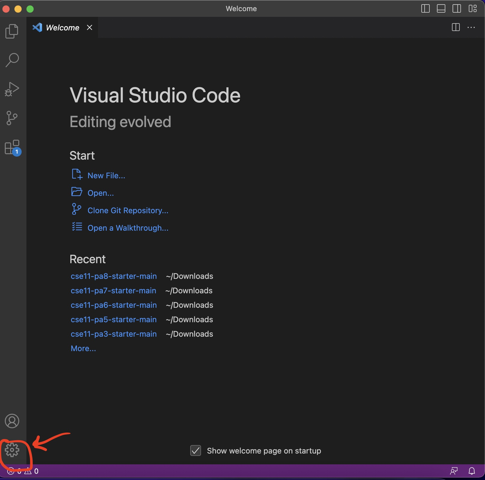
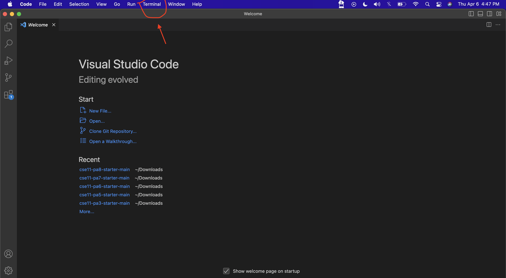

# Lab Report 1
*How to Log Into a Course-Specific Account on* `ieng6`:

**Step 1:** Installing VScode

  For this step, I already had VScode installed from a previous course. However,
  there was no option to select the default profile of `bash` or `zsh`. But with
  support from the TAs, I was able to pinpoint the problem, which was the fact that my
  version of VScode was not up to date.
  
  
  
  To solve a similar problem, click the settings button on the bottom-left corner and click "Check for
  Updates". VScode will then close to restart, and you will need to open the application again.
  
**Step 2:** Remotely Connecting

  To open a new terminal in VScode, at the very top click Terminal and then New Terminal.
  
